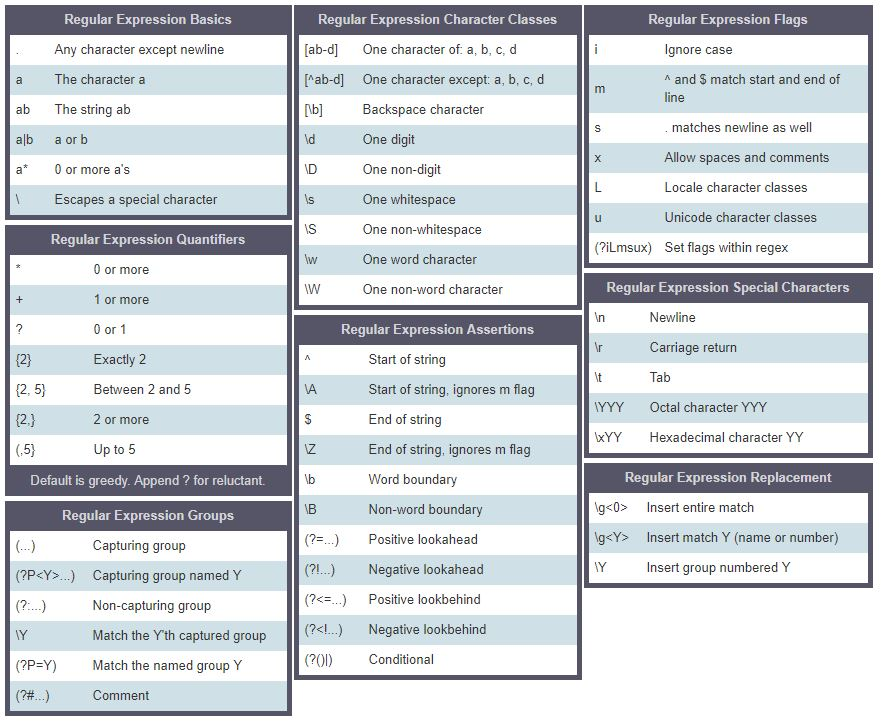

# Problemes
https://github.com/keon/algorithms

# Sessió 1. Python 1: tipus, llistes i iteracions

## Objectius
+ Saber fer operacions i gestionar variables amb enters, booleans, decimals i cadenes de text
+ Saber fer operacions bàsiques amb llistes
+ Conèixer el codi dels blocs ``if`` i de les iteracions ``for``

## Tipus 

Hi ha alguns tipus de dades bàsics que heu de conèixer per poder treballar amb Python: les cadenes de text, els enters, els decimals i els booleans.

### Cadenes de text (strings)

Una string és un text amb 0 o més caràcters. A Python els strings s'indiquen amb cometes simples o dobles. Si cal posar cometes dins el text podem usar la barra inversa \

```python
print('Això m\'agrada')
```
També hi ha una altra solució:

```python
print("Això m'agrada")
```

### Enters (integers)
Un ``int`` és un nombre que pertany al conjunt format pels nombres naturals, els negatius dels nombres natuarals i el 0. Els ordinadors poden respresentar enters fins a un límit (sempre ho farem amb un conjunt finit de bits) però amb els ordinadors actuals i per la majoria de problemes això no representa una limitació. 

Executa aquest codi i mira el resultat:

```python
print(234**7456)
```

Els enters s'han d'escriure sense el punt dels milers. Prova el següent codi i observa què passa:

```python
print(1.000.000.000)
```

Els enters també es poden representar en binari usant la funció ``bin``:

```python
print(4)
print(bin(4))
```

### Decimals (floats)
Un ``float`` és un nombre decimal. A Python, com en anglès, s'escriuen amb un punt separant la part entera de la part decimal. Com en el cas dels enters també hi ha un límit en la seva representació i en la precisió; aquests límits ens afectaran si usem càlculs amb nombres molt grans o amb molta precisió.

Degut a la representació interna dels decimals a Python, algunes operacions poden retornar valors curiosos. Per exemple:

```python
print((431/100)*100)
```

Retornarà 430.99999999999994 i no 431 com seria d’esperar. Per evitar-ho podeu usar les funcions ``round()``, ``ceiling()`` i ``floor()`` que arrodoneixen a l’enter més proper, a l’enter superior o a l’enter inferior respectivament.

```python
a=4.7
b=5.3
import math
print (a, round(a), math.ceil(a), math.floor(a))
print(b, round(b), math.ceil(b), math.floor(b))
```
### Booleans

Per conèixer més en detall els booleans consulteu si-us-plau els apunts de l'assignatura sobre llistes

- [Booleans](apunts/booleans.ipynb) 

### Conversió forçosa de tipus

A vegades podem forçar que una dada passi a ser d'un tipus determinat. Per fer-ho usarem l'expressió: ``nomTipus(valor)``. Vegeu els següents exemples:

```python
print(15/4)
print(int(15/4))
print(15+4)
print(float(15+4))
print("Jo tinc "+str(10)+" pomes")
```


## Llistes 

Per conèixer més en detall les llistes consulteu si-us-plau els apunts de l'assignatura sobre llistes

- [Llistes](apunts/colleccions.ipynb) 


## Blocs de control 

Per conèixer més en detall el funcionament de les estructures de control consulteu si-us-plau els apunts de l'assignatura sobre llistes

- [Estructures de control](apunts/control.ipynb)

# Sessió 2. Python 2: Estil programació, descomposició en funcions i estructures de control

## Objectius
+ Aprendre bones pràctiques en la denominació de funcions i variables i d'ús dels comentaris
+ Saber descomposar funcions en blocs reutilitzables
+ Conèixer el codi de les iteracions ``for`` i ``while``

## Estil de programació

Els programes sovint es comparteixen entre diferents programadors o es modifiquen al cap d'un temps.

Per això és important que estiguin escrits de forma clara i seguint unes convencions d'estil per fer-los més llegibles.

Cada llenguatge sol tenir unes directrius d'estil. A Python s'usen les directrius [PEP8](https://www.python.org/dev/peps/pep-0008/)

Spyder ens ajuda a seguir aquestes directrius si configurem l'editor per a què ens avisi. Això es fa amb ``Herramientas - Preferencias - Editor - Análisis de estilo del código en el Editor``.

Amb això Spyder ja ens avisarà si no seguim les convencions bàsiques de PEP8.

### Comentaris

Inicieu les funcions amb unes línies de comentaris delimitades per `"""` que indiquin l'objectiu de la funció. Incloeu una línia de comentari pels paràmetres, i una línia pel què retorna.

Incloeu comentaris breus addicionals entre línies amb # per explicar algun detall del codi en particular que no quedi prou clar.

```python
# Exemple

def primerDarrer8(llista):
    """
    Aquesta funció, donada una llista d’enters,
    retorna True si 8 és el primer o el darrer element de la llista,
    retorna False altrament
    :param llista una llista d'enters
    :return: True si 8 és a l'inici o final, False altrament
    """
    if llista[0]==8 or llista[-1]==8: # Amb -1 comencem pel darrera
        return True
    else:
        return False
```		


### Noms de funcions i de variables
Useu noms en minúscules per les funcions i variables. Si són compostes per dues o més paraules, inicieu la segona i següents amb majúscules.

```python
a = 5
meuCotxe = "Toyota"
valorAproximat = 3.567
def calculSuma(a,b):
    pass
```
Ara bé, per a les (falses) constants useu majúscules:

```python
MAXIM = 9999999
```

### Identació
Useu 4 espais per marcar els diferents nivells de blocs.

Si el codi d'una funció ocupa dues línies, identeu-lo per a què siguin consistents.
```python
def funcio():
    print("les instruccions comencen 4 espais a la dreta")
    for i in range(2):
        print("per cada nou bloc, 4 espais més")
		print("pero si vull posar moltes coses en un print",
              "i no m'hi caben, idento per a què sigui",
              "consistent")
```

### Llargada de les línies
Una línia de codi ha d'ocupar com a màxim 79 caràcters.
Si una línia no hi cap en 79 caràcters, la puc continuar amb el caràcter \

```python
with open('/path/to/some/file/you/want/to/read') as file_1, \
     open('/path/to/some/file/being/written', 'w') as file_2:
    pass
```
 El caràcter \ no cal si la continuació és dintre el mateix parèntesi que la línia anterior

```python
print('a', 'b', 'c', 'd', 'e', 'f', 'g', 'h', 'i', 'j', 'k', 'l', 'm', 'n', 'o', 'p', 'q', 'r',
      's', 't', 'u', 'v', 'x', 'y', 'z')
```

### Línies en blanc
Les funcions han d'anar precedides i seguides de dues línies en blanc.

### Espais en blanc
Deixeu espais en blanc davant i darrera dels operadors. Deixeu un espai en blanc darrera de la coma. No poseu espais en blanc al final de les línies de codi. Acabeu sempre les funcions amb un salt de línia.

```python
a = b + c
llista = ['a', 'b', 'c']
```

### Import
Posar cada import en una línia diferent. Situar-los al principi de tot.

```python
import math
import string


def funcio():
    pass
```

## Descomposició en funcions

En cursos més avançats realitzareu funcions força complexes que consistiran en molts passos. I en l'entorn laboral sovint aquestes funcions complexes repeteixen codi ja fet.

Per tal de facilitar la reutilització del codi, i facilitar el manteniment i llegibilitat, es recomana descomposar les funcions en parts petites amb significat.

Quan us enfronteu amb un problema, heu de mirar d'identificar aquelles parts del codi que resolen un problema i separar-les del codi principal.
Finalment, hi haurà una funció principal, que anirà cridant aquestes funcions més petites de forma ordenada, per resoldre el problema gran.

## Iteracions: `for` i `while`

Per conèixer més en detall el funcionament de les estructures de control, consulteu si-us-plau els apunts de l'assignatura sobre estructures de control:

-  [Estructures de control](apunts/control.ipynb)

## Codificació de caràcters

Per saber com es representen els caràcters a l'ordinador, consulteu si-us-plau els apunts de l'assignatura sobre codificació de caràcters:

-  [Caràcters](apunts/caracters.ipynb)


# Sessió 3: Algorísmes Numèrics

## Objectius
+ Resoldre de forma eficient problemes en els que intervenen conceptes simples de teoria de nombres: factors, primers, aritmètica, etc.
+ Usar de forma natural les *comprehensions* de Python
+ Mesurar empíricament el temps de càlcul d'un algorísme.

## Introducció a les comprensions de les llistes en Python. 

Les comprensions de les llistes són una eina per transformar una llista (qualsevol iterable en realitat) en una altra llista. Durant aquesta transformació, els elements es poden incloure de manera condicional a la nova llista i cada element es pot transformar segons sigui necessari.

Cada comprensió es pot reescriure com un bucle sobre la lista, però no tot bucle es pot reescriure com a comprensió de la llista.

Començant pel cas més senzill, una comprensió de llista com aquesta:

```python
a = [func(element) for element in sequence]
```

és equivalent a:

```python
a = []
for element in sequence:
    a.append(func(element))
```

De la mateixa manera que podeu afegir `for` addicionals als bucles i condicions `if` dins dels bucles, també podeu afegir-les a la comprensió.

La clau a entendre és que l'ordre d'esquerra a dreta en la comprensió assigna el mateix ordre als bucles explícits:

```python
a = [func(element) for subseq in seq2d for element in subseq if pred(element)]

a = []
for subseq in seq2d:
    for element in subseq:
        if pred(element):
            a.append(func(element))
```

## Mesura empírica del cost computacional.

`timeit` és un mòdul python que ens permet mesurar de forma aproximada el temps de procés d'unes linies de codi:

```pyton
import timeit

start_time = timeit.default_timer()
func1()
print(timeit.default_timer() - start_time)

start_time = timeit.default_timer()
func2()
print(timeit.default_timer() - start_time)
``` 

Si treballem en un notebook de Jupyter podem fer servir la instrucció `%timeit` per calcular el temps de càlcul d'un línia de codi:

```python
def f(x):
    return x*x

%timeit for x in range(100): f(x)

> 100000 loops, best of 3: 20.3 µs per loop
```

Si poseu `%%timeit` al principi d'una cel·la calculareu el temps de càlcul de tota la cel·la.

```python
%%timeit 
l = []
for i in range(1000):
    l.append(i**2)

> 1000 loops, best of 3: 340 µs per loop
```
## Complexitat de les operacions més habituals de Python

L'assignació d'un valor a una variable (que s'implementa mitjançant la còpia d'una referència) és `O(1)`. 

Els operadors simples (`+`, `*`, etc.) sobre enters petits (menors de 12 dígits) són `O(1)`.

Els operadors sobre col·leccions de dades de longitud `N`, `N = len(data-type)` són:

### Lists:
                               
Operació      | Exemple      | Complexitat     | Notes
--------------|--------------|---------------|-------------------------------
Index         | l[i]         | O(1)	     |
Store         | l[i] = 0     | O(1)	     |
Length        | len(l)       | O(1)	     |
Append        | l.append(5)  | O(1)	     |
Pop	          | l.pop()      | O(1)	     | equivalent a l.pop(-1)
Clear         | l.clear()    | O(1)	     | equivalent a l = []
Slice         | l[a:b]       | O(b-a)	 | O(len(l)-0)=O(N)
check ==, !=  | l1 == l2     | O(N)      |
Insert        | l[a:b] = ... | O(N)	     |
Delete        | del l[i]     | O(N)	     | 
Containment   | x in/not in l| O(N)	     | cerca a la llista
Copy          | l.copy()     | O(N)	     | equivalent a l[:] que és O(N)
Remove        | l.remove(...)| O(N)	     | 
Pop	          | l.pop(i)     | O(N)	     | 
Extreme value | min(l)/max(l)| O(N)	     | cerca a la llista
Reverse	      | l.reverse()  | O(N)	     |
Iteration     | for v in l:  | O(N)          |
Sort          | l.sort()     | O(N Log N)    | 

### Sets

Operació      | Exemple      | Complexitat     | Notes
--------------|--------------|---------------|-------------------------------
Length        | len(s)       | O(1)	     |
Add           | s.add(5)     | O(1)	     |
Containment   | x in/not in s| O(1)	     | 
Remove        | s.remove(..) | O(1)	     | 
Discard       | s.discard(..)| O(1)	     | 
Pop           | s.pop()      | O(1)	     |
Clear         | s.clear()    | O(1)	     | equivalent a s = set()
check ==, !=  | s != t       | O(len(s))     | 
<=/<          | s <= t       | O(len(s))     | issubset
\>=/>         | s >= t       | O(len(t))     | issuperset 
Union         | s l t        | O(len(s)+len(t)) |
Intersection  | s & t        | O(len(s)+len(t)) |
Difference    | s - t        | O(len(s)+len(t)) |
Symmetric Diff| s ^ t        | O(len(s)+len(t)) |
Iteration     | for v in s:  | O(N)          |
Copy          | s.copy()     | O(N)	     |

### Dictionaries
                             
Operació      | Exemple      | Complexitat     | Notes
--------------|--------------|---------------|-------------------------------
Index         | d[k]         | O(1)	     |
Store         | d[k] = v     | O(1)	     |
Length        | len(d)       | O(1)	     |
Delete        | del d[k]     | O(1)	     |
get/setdefault| d.method     | O(1)	     |
Pop           | d.pop(k)     | O(1)	     |
Pop item      | d.popitem()  | O(1)	     |
Clear         | d.clear()    | O(1)	     | equivalent a s = {} o = dict()
View          | d.keys()     | O(1)	     | el mateix que d.values()
Iteration     | for k in d:  | O(N)      | totes les formes: keys, values, items

# Sessió 4: Text

## Expressions regulars

([Més informació](https://goo.gl/RZX1Wi))

Les expressions regulars representen cadenes de caràcters que han de trobar-se en un text. Per a substituir o declarar certs caràcters i conjunts de caràcters semblants s'empren els *metacaràcters*. Una expressió regular es declara, com les cadenes de caràcters, dins de cometes simples o dobles.

Els *metacaràcters* són: ``. ^ $ * + ? { } [ ] \ | ( )``

Tots els altres són caràcters normals. 

Un *metacaràcter* es transforma en caràcter normal si s'escriu precedit d'un caràcter d'escapada ``\``.  Així ``\$`` s'interpreta com el caràcter normal ``$``. Per transformar en caràcter normal el ``\``, cal escriure'n dos de seguits, així ``\\`` s'interpreta com el caràcter normal ``\``.

Si una expressió regular està formada només per caràcters normals, la única cadena que hi encaixa és la pròpia cadena en què consisteix l'expressió regular, així l'expressió regular ``Hola`` defineix un conjunt de cadenes amb un únic element que és la cadena ``Hola``, o l'expressió regular ``Preu = 500\$`` defineix un conjunt de cadenes amb un únic element que és la cadena ``Preu = 500$``.

```python
import re
text = ["Preu = 500$", "Preu = 333$", "Preu = 500€"]
for t in text:
    if re.search(r"Preu = 500\$",t):  # re.search és un objecte
        print(t)
>>> Preu = 500$
```

L'avantatge de les expressions regulars és que a més de poder definir cadenes permet dues característiques més: 
+ que un caràcter de la cadena pertanyi a un conjunt i 
+ que un caràcter o tota una expressió regular es pugui repetir. 

Amb aquestes dues característiques addicionals les expressions regulars es converteixen en una eina molt potent a l'hora de definir conjunts de cadenes per a cercar en un text.

## Conjunts de caràcters

Si en una expressió regular hi ha el metacaracter ``.`` hi encaixen totes les cadenes que encaixin en la resta de l'expressió regular independentment del caràcter que tinguin el la posició on hi ha el punt (excepte el caràcter “salt de línia”). 

Per exemple l'expressió regular ``.`` defineix el conjunt de totes les cadenes de un únic caràcter (tret del salt de línia), l'expressió regular ``.ala`` defineix el conjunt de totes les cadenes de 4 caràcters que tinguin els caràcters “ala” en les posicions segona, tercera i quarta independentment de quin sigui el caràcter que tinguin en la posició primera

```python
import re
text = ["Preu = 530$", "Preu = 333$", "Preu = 500€"]
for t in text:
    if re.search(r"Preu = 5.0.",t):  # re.search és un objecte
        print(t)
>>> Preu = 530$
>>> Preu = 500€
```

Els metacaracters ``[`` i ``]`` es fan servir per definir conjunts de caràcters. Si en una expressió regular apareix un conjunt de caràcters en una posició determinada, en aquella posició hi encaixa qualsevol caràcter que pertanyi a aquell conjunt. Una manera de fer servir aquests metacaràcters per definir un conjunt és ficar-los encerclant una cadena, per exemple ``[abc]`` defineix el conjunt format pels caràcters ``a``, ``b`` i ``c`` . Per exemple l'expressió regular ``[b p]ala`` defineix el conjunt de cadenes de 4 caràcters tals que el seu primer caràcter és un membre del conjunt definit per ``[b p]`` i els caràcters segon tercer i quart són respectivament ``a``, ``l``, i ``a`` per tant, defineix el conjunt de cadenes els elements del qual són: ``bala``, `` ala`` i ``pala`` i no forma part d'aquest conjunt la cadena ``%ala``.

Els metacaràcters ``^``,``-`` i ``\`` tenen un significat especial dins de la definició d'un conjunt de caràcters.

El metacaràcter ``–`` serveix per definir conjunts de caràcters que estan seguits en el codi ASCII sense haver-los d'escriure un per un, només escrivint el primer i l'últim, així el conjunt definit per ``[abcdef]`` és el mateix que el definit per ``[a-f]`` (compte que les vocals accentuades i lletres com la ``ç`` no estan per ordre alfabètic en el codi ASCII).

El matacaràcter ``^`` si es coloca al començament de la cadena serveix per definir el complementari d'un conjunt (en qualsevol altre lloc simplement s'interpreta com el caràcter ``^``). Per exemple, el conjunt ``[^ ]`` és el conjunt de tots el caràcters tret de l'espai en blanc.

El matacaràcter ``\`` davant de certes lletres serveix per designar certs conjunts de caràcters predefinits: 
+ ``\d`` dígits decimals: ``\D`` tot tret dels dígits decimals. 
+ ``\s`` espai blanc . 
+ ``\n`` salt de linia.
+ ``\S`` Tot tret dels caràcters tipus espai blanc. 
+ ``\w`` qualsevol caràcter alfanumèric.
+ ``\W`` tot tret dels caràcters alfanumèrics.

Tot això es pot combinar, per exemple, l'expressió regular: ``a[\s.]b[a-v\d]c`` defineix el conjunt de cadenes de 5 caràcters tals que els seus caràcters primer tercer i cinquè són respectivament ``a``, ``b`` i ``c`` i els seus caràcters segon i quart pertanyen respectivament als conjunts definits per ``[\s.]`` i ``[a-v\d]``, on el conjunt definit per ``[\s.]`` és o bé un caràcter de tipus espai blanc o bé qualsevol caràcter tret del salt de línia (que és el que indica el ``.``). Per tant és qualsevol caràcter incloent-hi el salt de línia. El conjunt definit per ``[a-v\d]`` és qualsevol lletra minúscual de la ``a`` a la ``v`` ambdues incloses o un dígit decimal. Per tant les cadenes ``a%b3c`` i ``abbvd`` pertanyen al conjunt mentre que les cadenes ``abbxd`` i ``b%b3c`` no.

## Repeticions

Els metacaràcters ``+``, ``*``, ``?`` i ``{``, ``}`` es fan servir per indicar repeticions de l'objecte **precedent** que pot ser un caràcter o una expressió regular. ``+`` indica 1 vegada o més, ``*`` cap o més, ``?`` cap o una i ``{n,m}`` entre n i m repeticions totes dues incloses.

Per exemple les expressions regulars:

+ ``ab?c`` defineix el conjunt de cadenes amb els elments: ``abc`` i ``ac``; la primera cadena “encaixa” perquè el caracter “b” es repeteix una vegada i la segona ”encaixa” perquè no es repeteix cap vegada.

+ ``ab{2,5}c`` defineix el conjunt de cadenes que té els elements: ``abbc``, ``abbbc``, ``abbbbc`` i ``abbbbc`` que encaixen perquè en totes elles el caràcter “b” es repeteix entre 2 i 5 vegades, però no conté la cadena “abc” ni la cadena “abbbbbbc” perque en el primer cas el caracter “b” només es repeteix una vegada i en el segon es repeteix 6 vegades.

+ ``ab*c`` defineix el conjunt de cadenes amb infinits elements (en la pràctica el màxim són 2 bilions de repeticions) que conté els elements: “ac”, “abc”, “abbc”, “abbbc”... Cal tenir en compte que 0 repeticions, és a dir la absència del caràcter, encaixa.

+ ``ab+c`` defineix el conjunt de cadenes amb infinits elements (en la pràctica el màxim són 2 bilions de repeticions) que conté els elements: “abc”, “abbc”, “abbbc”... Ara no s'admet 0 repeticions, és a dir la absència del caràcter, no encaixa.

A l'esquerra dels metacaràcters de repetició també hi pot haver un conjunt. Per exemple l'expressió regular ``a[1-3]?b`` defineix el conjunt de cadenes amb els elements: “ab”, “a1b”, “a2b” i “a3b” el primer perquè té 0 repeticions i els tres següents perquè hi ha una repetició d'elements que pertanyen al conjunt definit per [1-3]. Per exemple l'expressió regular ``a[12]{1,2}b`` defineix el conjunt format per les cadenes: “a1b”, “a2b”, “a11b”, “a12b”, “a21b” i “a22b” les dues primeres perquè tenen una repetició d'algun dels elements del conjunt de caràcters definit per ``[12]`` i les quatre últimes perquè en tenen dues.

A l'esquerra dels metacaràcters de repetició també hi pot haver una expressió regular, el resultat és el mateix que l'expressió regular que s'obtindria repetint la cadena que defineix l'expressió regular prèvia el nombre de vegades indicat pels metacaràcters de repetició. 

Per exemple l'expressió regular: ``(ab){2,3}`` defineix el conjunt de cadenes obtingut per la unió dels conjunts de cadenes que defineixen l'expressió regular “abab” i “ababab” en la primer hi ha dues repeticions i en la segona tres, la primera defineix el conjunt de cadenes amb un únic element, la cadena “abab” i la segona el conjunt amb l'únic element “ababab” i la unió dels dos és el conjunt amb els elements “abab” i “ababab”. 

Per exemple l'expressió regular: ``(a[bc]){1,2}`` defineix el conjunt de cadenes obtingut per la unió dels conjunts de cadenes que defineixen l'expressió regular “a[bc]” i “a[bc]a[bc]” en la primer hi ha una repetició i en la segona dues repeticions, la primera defineix el conjunt de cadenes que té per elements “ab” i “ac” i la segona el conjunt amb els elements “abab”, “abac”, “acab” i “acac” i la unió dels dos és el conjunt amb els elements “ab”, “ac”, “abab”, “abac”, “acab” i “acac”.




## Expressions regulars en PYTHON

En Python, el primer que hem de fer és compilar l'expressió d'interès:

L'expressió
```python
import re
p = re.compile('ab*')
p
>>> re.compile(r'ab*', re.UNICODE)
```
produeix una expressió compilada que pot ser usada amb els mètodes de les expressions regulars:

Method/Attribute | 	Purpose
------------ | -------------
match() | 	Determine if the RE matches at the beginning of the string.
search()	 | Scan through a string, looking for any location where this RE matches.
findall()	 | Find all substrings where the RE matches, and returns them as a list.
finditer()	 | Find all substrings where the RE matches, and returns them as an iterator.

### match

```python
import re
p = re.compile('[a-z]+')
p.match("")
print(p.match(""))
>>> None
m = p.match('tempo')
m
>>> <_sre.SRE_Match object; span=(0, 5), match='tempo'>
```
que ens retorna un objecte ```match```sobre el que podem fer preguntes:

Method/Attribute | Purpose
------------ | -------------
group()	 | Return the string matched by the RE
start()	 | Return the starting position of the match
end()	 | Return the ending position of the match
span()	 | Return a tuple containing the (start, end) positions of the match

```python
m.group()
>>> 'tempo'
m.start(), m.end()
>>> (0, 5)
m.span()
>>> (0, 5)
```
### search

```python

import re

line = "Cats are smarter than dogs";
searchObj = re.search( r'(.*) are (.*?) .*', line)

if searchObj:
   print "searchObj.group() : ", searchObj.group()
   print "searchObj.group(1) : ", searchObj.group(1)
   print "searchObj.group(2) : ", searchObj.group(2)
else:
   print "Nothing found!!"

>>> searchObj.group() :  Cats are smarter than dogs
>>> searchObj.group(1) :  Cats
>>> searchObj.group(2) :  smarter
```

### find

```python
p = re.compile('\d+')
p.findall('12 drummers drumming, 11 pipers piping, 10 lords a-leaping')
>>> ['12', '11', '10']
```

```python
text = "He was carefully disguised but captured quickly by police."
re.findall(r"\w+ly", text)
>>> ['carefully', 'quickly']
```

```python
text = "He was carefully disguised but captured quickly by police."
for m in re.finditer(r"\w+ly", text):
     print('%02d-%02d: %s' % (m.start(), m.end(), m.group(0)))
>>> 07-16: carefully
>>> 40-47: quickly
``` 

# Sessió 5. Complexitat dels algorismes i treball amb fitxers

En aquesta sessió es reforcen els conceptes bàsics per calcular la complexitat d'un algorisme. També es veuen les funcions de Python relacionades amb la lectura i escriptura de fitxers.

# Complexitat


## Càlcul

Estimem la complexitat d'un algorisme comptant el nombre de funcions elementals que fa l'algorisme. Usualment calcularem el temps del pitjor cas, i usarem la notació gran O.

Anem a veure uns casos simples de càlcul de complexitats:

### Complexitat d'una operació

*operació simple*

En general la complexitat d'aquest cas és d'ordre Constant, ja que no depèn de la mida de l'entrada. Però atenció, quan treballem amb llistes algunes operacions aparentment simples, tenen una complexitat d'ordre **n**. Recordeu que en anteriors sessions hem especificat l'ordre de complexitat de les operacions més habituals amb col.leccions. Altres complexitats les podeu consultar a <a href="https://wiki.python.org/moin/TimeComplexity">TimeComplexity </a>

- LLista.append('a')                    # complexitat O(1)
- Llista.insert(2,'a')                  # complexitat O(n)

### Complexitat d'un bloc condicional
+ if condicio:
    + operacio1
+ else:
    + operacio2

Quan ens trobem amb un bloc condicional (if, elif, else) la complexitat serà la màxima de les complexitats de les diferents opcions. Per ex. si complexitat(operacio1)=O(n) i complexitat(operacio2)=O(1), la complexitat del bloc if serà de O(n), que és l'opció amb més complexitat.

### Complexitat d'un conjunt d'instruccions

    def: funcio(): 
        operacio1 
        operacio2 
        operacio3 
        operacio4 
        operacio5 
        if condicio: 
            operacio6 
        else: 
            operacio7 


Quan s'agrupen diverses operacions simples la complexitat és la suma de totes elles, tenint en compte que quan treballem amb ordres de magnitud i sumem diverses quantitats, només ens quedem amb la cota superior, que és la que mana. 

Així si complexitat(operacio1)==complexitat(operacio2)==complexitat(operacio3) és O(1), i la complexitat(operacio4) és O(n^2), i la complexitat(operacio5) és O(log n), la complexitat de totes aquestes serà d'ordre O(n^2), que és la complexitat major. I sumant la complexitat del bloc condicional (operacio6 és O(n) i operacio7 és O(1)), seguim tenint O(n^2), ja que aquest ordre predomina sobre O(n).

La complexitat final d'aquest bloc és O(n^2).

### Complexitat dels blocs iteratius (bucles)

    for i in range(1,n): 
        operacio1 
    
    for j in range(1,n): 
        operacio1

En el cas dels bucles iteratius, primer cal calcular la complexitat de les operacions dins el bucle, i després multiplicar-les pel nombre de vegades que iterem.
En els exemples, si complexitat(operacio1) és O(1), la complexitat dels blocs és O(n), ja que tots -- en el pitjor cas -- iteren n vegades sobre aquesta operació.

### Complexitat dels blocs iteratius imbricats

    for i in range(1,n):
        for j in range(1,n): 
            operacio1

En el cas dels bucles imbricats cal multiplicar tantes vegades com bucles hi hagi. A l'exemple, la complexitat del bloc de la j és O(n) però la complexitat del bloc de la i és O(n^2). És a dir, aquest tros de codi té una complexitat quadràtica.

### Complexitat de les funcions recursives

#### Explicació de la recursió

La recursió consisteix en què un programa es crida a si mateix. Un programa recursiu ben fet ha de complir 2 condicions:

- ha d'haver-hi un o més casos base: són condicions de les dades que es resolen directament, sense que calgui una nova crida al programa
- a cada crida recursiva ens apropem a un dels casos base: ja sigui perquè es decrementa una variable, perquè es redueix una llista...

```python
Exemple
def imprimirLlistaRec(num):
    if (num == 0):
        print(num)
        return 0
    else:
        print(num)
        imprimirLlistaRec(num-1)

imprimirLlistaRec(5)
5
4
3
2
1
0
```

- A la primera execució del programa num valia 5, per tant no és un cas base, es fa el print i es fa una crida recursiva amb 4.
- A la segona execució val 4, s'imprimeix i es fa crida amb 3.
- A la tercera val 3, s'imprimeix i es fa crida amb 2.
- A la quarta val 2, s'imprimeix i es fa crida amb 1.
- A la cinquena val 1, s'imprimeix i es fa crida amb 0.
- A la sisena val 0, som al cas base!, s'imprimeix i acaba.

A vegades dins del programa no es fa una crida recursiva sinó dues o més. També pot variar com s'alteren les variables a cada crida, però sempre ens hem d'anar apropant al cas base.

Sovint farem un programa principal que faci un preprocés de les dades, cridi al programa recursiu, i després faci un postprocés.

```python
def imprimirLlista(num):
    print(f"Ara mostrarem els nombres de {num} a 0 de manera decreixent")
    imprimirLlistaRec(num)
    print("I això és tot.")
    
imprimirLlista(3)

Ara mostrarem els nombres de 3 a 0 de manera decreixent
3
2
1
0
I això és tot.
```

#### Càlcul complexitat
En aquest curs només heu vist com calcular la complexitat de les funcions recursives que segueixen el patró: T(n)=aT(n/b)+O(n^d), on a són els subproblemes generats i ha de ser >0,b és el divisor de n a cada crida i ha de ser >1 i d és el cost d'ajuntar les solucions,i ha de ser>0. El càlcul d'aquestes funcions es calcula segons el teorema de màster. 

Veiem-ne un exemple:

    def exponent(base,ponencia):
        if potencia==1: 
            return base 
        else:
            subsolucio=exponent(base,potencia/2)
            return subsolucio x subsolucio x base^potencia%2

Per calcular la complexitat hem de saber quants subproblemes es generen (a), per quant dividim la n en cada nova crida (b), i quin és l'exponent del cost d'ajuntar les solucions (d).

A la funció exponent anterior, aquests valors són, respectivament:

 + a=1, fem una única crida recursiva
 + b=2, a cada crida, n es parteix per dos
 + d=2, ja que ajuntar les solucions es fa amb una multiplicació  O(2)

Un cop tenim aquests valors, calculem el valor pel Teorema del màster aplicant el cas que correspon:

 + Si d>log base b d'a, el cost serà O(n^d)
 + Si d=log base b d'a, el cost serà O(n^d log n)
 + Si d<log base b d´a, el cost serà O(n^log b a)

A la funció exponent anterior:
log 2 1=0; per tant estem en el primer cas del teorema de màster, d>log b a, i el cost és d'ordre O(n^d), i com que d=2, això equival a O(n^2).
Podem concloure que la funció exponent té una complexitat de O(n^2).


# Fitxers

Sovint les dades d´un algorisme es troben a memòria permanent en un fitxer. Des de Python podem llegir i escriure fitxers amb algunes instruccions particulars. En aquesta assignatura només veurem fitxers de text.

## Obrir un fitxer i tancar-lo
Per poder treballar amb un fitxer primer de tot cal obrir-lo

**Atenció**: el fitxer ha de ser a la mateixa carpeta que la funció (que el notebook o que l'arxiu .py)

```python
elMeuFitxer = open("nom fitxer","mode") 
```
a on nom fitxer és el nom del fitxer en el disc i mode pot ser r (read) per llegir, w (write) per escriure [si no hi ha cap fitxer això el crea] o altres que no tractarem.

Per exemple:
```python
elMeuFitxer = open("prova.txt","r") 
```
obre el fitxer prova.txt en mode lectura (només podrem llegir, no escriure)

Hem de pensar sempre a tancar els fitxers un cop oberts perquè altrament es podrien produir resultats inesperats a l´hora de fer altres entrades o sortides o podriem tenir problemes de memòria.

```python
elMeuFitxer.close()
```

## Escriure 

Un cop tinguem el fitxer obert ja podem fer coses amb ell. Per ex:

```python
fitxer = open("fitxerprova.txt","w") 
 
fitxer.write("Hola món\n") # el caràcter \n indica salt de línia
fitxer.write("Aquest és el nostre fitxer de text nou\n") 
fitxer.write("i això és una línia nova\n") 
fitxer.write("I el fitxer s'ha creat.\n") 
 
fitxer.close() 
```

I efectivament si mirem el fitxer amb un editor de text, a dintre hi veurem:
```python
Hola món
Aquest és el nostre fitxer de text nou
i això és una línia nova
I el fitxer s´ha creat.
```

## Llegir

Quan llegim un fitxer python ens retorna un string amb el seu contingut

```python
file = open("fitxerprova.txt", "r") 
print(file.read())
file.close() 
```

Que ens mostrarà:

```python
    Hola món
    Aquest és el nostre fitxer de text nou
    i això és una línia nova
    I el fitxer s'ha creat.
```


o també podem optar a llegir-lo línia a línia
```python
file = open("fitxerprova.txt", "r") 
print(file.readlines())
file.close() 
```
Que ens mostrarà
```python
['Hola món\n', 'Aquest és el nostre fitxer de text nou\n', 'i això és una línia nova\n', 'I el fitxer s'ha creat.\n']
```

Podem també recorrer un fitxer dins una iteració:
```python
file = open("fitxerprova.txt", "r") 
for l in file:
    print(l)
file.close() 
```

Que ens mostrarà
```python
Hola món

Aquest és el nostre fitxer de text nou

i això és una línia nova

I el fitxer s'ha creat..
```

## Gestió elegant de fitxers
Quan volem fer diverses accions de lectura sobre un fitxer podem usar l´ordre with...

```python
with open("fitxerprova.txt") as file:  
    data = file.read() 
    do something with data 
```

amb el with obrim sempre en mode lectura, i no ens cal indicar el tancament

És molt recomanable doncs usar aquesta sintaxi quan s´escau.


## Referències
Les explicacions, exemples i exercicis s'han basat en les següents fonts:

- Singh et al. “Time complexity of algorithms” dins Study tonight [http://www.studytonight.com/data-structures/time-complexity-of-algorithms] consultat el 26 de novembre de 2015
- Umesh V. Vazirani “Chapter 2: divide and conquer algorithms” [https://www.cs.berkeley.edu/~vazirani/algorithms/chap2.pdf] consultat el 26 de novembre de 2015
- Cormen, T. C., Leiserson, C. E., Rivest, R. L., & Stein, C. (2009). *Introduction to algorithms* (3rd ed.). Cambridge: The MIT Press. ISBN 9780262033848
- Python for beginners "Reading and writing files in Python. Overview" http://www.pythonforbeginners.com/files/reading-and-writing-files-in-python


# Sessió 6: Ordenació i cerca.

En aquesta sessió revisem i apliquem els principals algorismes d'ordenació i cerca vistos a teoria. La majoria de problemes en que volem moure elements en una llista o cercar alguns valors específics són variacions d'aquests problemes.

És per això que cal entendre molt bé el funcionament d'aquests algorismes bàsics per així poder-los adaptar al problema particular a resoldre.

Com a treball previ a la sessió de problemes podeu lliurar un paper amb nom i cognom i la resposta a les preguntes:
1.1, 2.2, 3.1, 3.2, 4.1, 4.2, 5.1, 5.2, 6.1.

## MergeSort, O(n log n)

```python
def merge(left, right):
    """
    Aquesta funció fusiona dues llistes ordenades amb una de nova, també ordenada
    """
    result = []
    i ,j = 0, 0
    while(i < len(left) and j < len(right)):
        if (left[i] <= right[j]):
            result.append(left[i])
            i = i + 1
        else:
            result.append(right[j])
            j = j + 1

    result += left[i:]
    result += right[j:]
    return result
    
def mergesort(list):
    """
    Aquesta funció va partint la llista en una banda dreta i una esquerra
    fins que aquestes bandes tenen un element
    quan ho aconsegueix, crida merge per fusionar ambdues bandes de 
    manera ordenada
    fins arribar a fusionar la llista completa original.
    """
    if len(list) < 2:
        return list
    else:
        middle = len(list) // 2
        left = mergesort(list[:middle])
        right = mergesort(list[middle:])
        return merge(left, right)

mergesort([9,8,4,2,7,-4,3])
>>> [-4, 2, 3, 4, 7, 8, 9]
 
```

## QuickSort, O(n log n)

```python
def partition(A, first, last):
    """
    Aquesta funció tria el valor mig entre l'element inicial, final i mig 
    d'una llista i l'ubica al lloc que li correspondrà quan la llista està 
    ordenada, alhora deixa a la seva esquerra valors menors i a la dreta
    valors majors. Per tant altera A
    A més retorna la posició de la partició
    """
    mid = (first + last)//2  #ordenem A[first],A[mid],A[last]
    if A[first] > A [mid]: A[first], A[mid] = A[mid], A[first]
    if A[first] > A [last]: A[first], A[last] = A[last], A[first]
    if A[mid] > A[last]:   A[mid], A[last] = A[last], A[mid]  
    A[mid], A[first] = A[first], A[mid] #valor mig a l’inici
    pivot = first
    i = first + 1
    j = last
  
    while True:
        while i <= last and A[i] <= A[pivot]: i += 1
        while j >= first and A[j] > A[pivot]: j -= 1
        if i >= j: break
        else:
            A[i], A[j] = A[j], A[i] #intercanviem, fem avançar i j
    A[j], A[pivot] = A[pivot], A[j] #vector partit, pivot=j
    return j
    
def quick_sort(A):
    quick_sort_r(A, 0, len(A) - 1)

def quick_sort_r(A , first, last):
    if last > first:
        pivot = partition(A, first, last)
        quick_sort_r(A, first, pivot - 1)
        quick_sort_r(A, pivot + 1, last)

A=[9,8,4,2,7,-4,3]
quick_sort(A)
print(A)
>>> [-4, 2, 3, 4, 7, 8, 9]
```

## Cerca lineal, de complexitat O(n)

```python
def search(list,ele):
    list.append(ele)
    i=0
    while list[i] != ele:
        i += 1
    if i<len(list)-1: 
        return i
    else: 
        return -1

search([9,8,4,2,7,-4,3],4)
>>> 2
```

## Cerca binària, de complexitat O(logn)

```python
def binsearch(x,nums):
    recbinsearch(x,nums,0,len(nums)-1)
    
    
def recbinsearch(x, nums, low, high):
    # low, high defineixen els limits de la llista
    # on buscar, així no cal crear noves llistes
    if low>high: 
        return -1
    mid = (low + high) // 2    
    items = nums[mid]   
    if items == x:
        print(mid)
    elif x < items:
        return recbinsearch(x,nums,low,mid-1)
    else: 
        return recbinsearch(x,nums,mid+1,high)

binsearch(5,[1,2,3,4,5,6,7])
>>> 4
```
